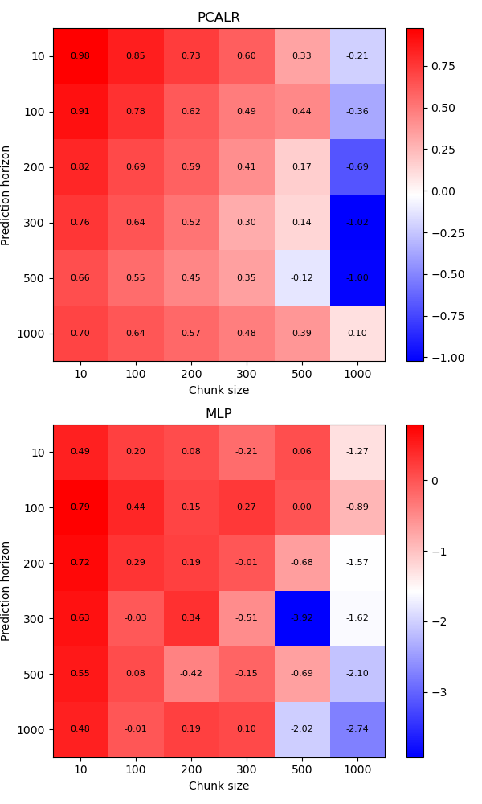
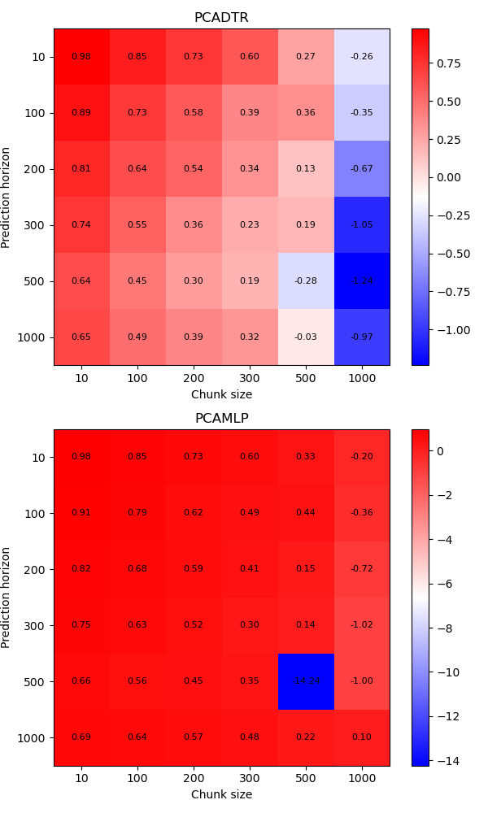

# Porównanie LR, KNN, SVR, CART i MLP
Na podstawie eksperymentu_1 wygenerowałam porównanie regresorów KNN, SVR I drzew CART (na wykresie DTR).
Wyszły porównywalnie dobre co PCALR.

```python
#Metody z użytymi parametrami
methods = {"KNN": KNeighborsRegressor(weights='distance'), "SVR": SVR(), "DTR": DecisionTreeRegressor()}
```

(im więcej wykresów tym gorszy opis osi X)


Z siecią neuronową nie było już tak prosto, dla porównania zestwiono MLP Z PCALR.
```python
ConvergenceWarning: lbfgs failed to converge (status=1):
STOP: TOTAL NO. of ITERATIONS REACHED LIMIT.

Increase the number of iterations (max_iter) or scale the data as shown in:
```
Biorąc pod uwagę powyższy błąd zwiększyłam max_iter. Proponowany solver "lbfgs"
```python
methods = {"PCALR": met.PCALR(weights='distance'), "MLP": MLPRegressor(solver="lbfgs", hidden_layer_sizes=(8,), max_iter=5000)}
```


Zmniejszyłam parameter _hidden_layer_sizes_ do 3, ale nadal wyniki były słabe

```python
methods = {"PCALR": met.PCALR(weights='distance'), "MLP": MLPRegressor(solver="lbfgs", hidden_layer_sizes=(3,), max_iter=5000)}
```


Ostatecznie zrezygowałam z parametru max_iter, zostawiłam go domyślnie
```python
methods = {"PCALR": met.PCALR(weights='distance'), "MLP": MLPRegressor(solver="lbfgs", hidden_layer_sizes=(3,))}
```


Ostatecznie zrezygowałam z parametru max_iter, zostawiłam go domyślnie
```python
methods = {"PCALR": met.PCALR(weights='distance'), "MLP": MLPRegressor(solver="lbfgs", hidden_layer_sizes=(5,))}
```



Wyszło na to, że mniej neuronów = lepiej. 

Znalazłam w dokumentacji, że dla używanego solvera ma jeszcze znaczenie parametr _max_fun_ oznaczający maksymalną liczbę wywołań funkcji
Przy poniższych ustawieniach wynik jak dotąd najlepszy pogorszył się. W niektórym przypadku nawet gorzej niż regresja liniowa.
```python
methods = {"PCALR": met.PCALR(weights='distance'), "LR": LinearRegression(), "MLP": MLPRegressor(solver="lbfgs", hidden_layer_sizes=(3,), max_fun=1000)}
```


Najlepsze wynik na który wpadłam był dla ustawień:
```python
methods = {"PCALR": met.PCALR(weights='distance'), "LR": LinearRegression(), "MLP": MLPRegressor(solver="lbfgs", hidden_layer_sizes=(1,))}
```


#PCA dla każdego z regresorów
## n_components: 2
(ustawienia tak jak powyżej, dla MLP ostatniego (chyba najlepszego) uzyskanego wyniku)


(Wyniki dla MLP wypadały różnie, np.:)


## n_components: 10

